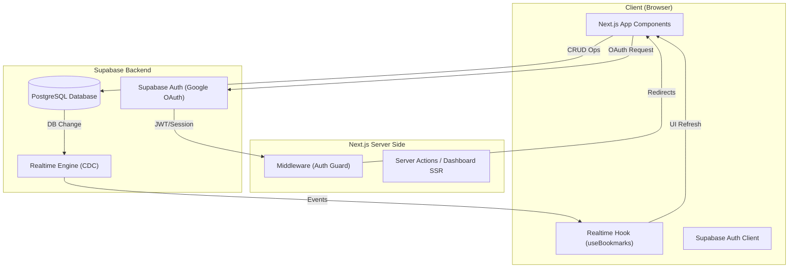
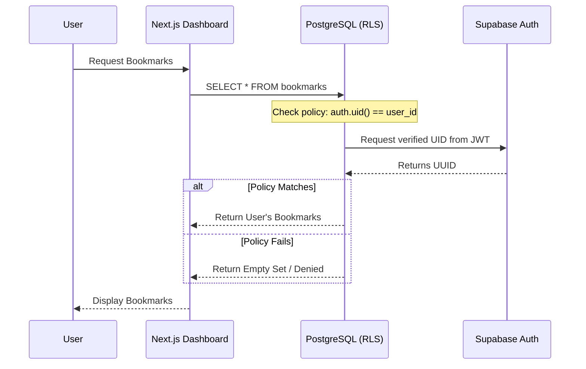
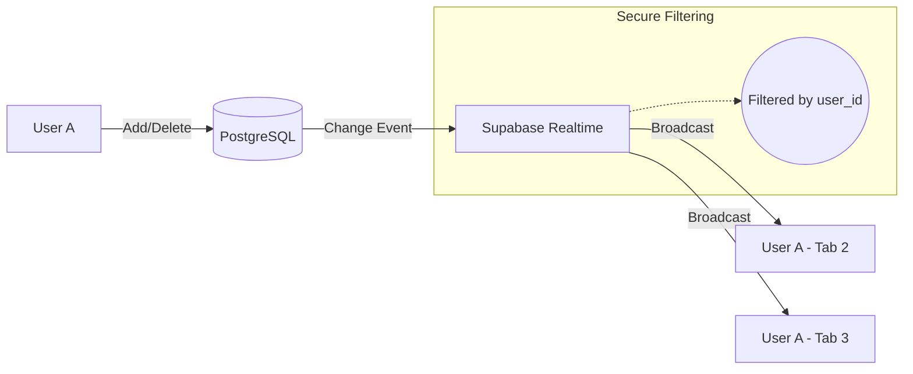

# Smart Bookmark App Architecture

This document provides a technical overview of the system architecture, data flow, and security model of the Smart Bookmark App.

## 🏗️ High-Level System Overview

The application follows a modern Serverless / BaaS (Backend-as-a-Service) architecture using **Next.js 15**, **Tailwind CSS**, and **Supabase**.

---

## 🔐 Data Security & RLS Flow

Row Level Security (RLS) ensures that the database itself is the source of truth for security, preventing any unauthorized access.

---

## 🔥 Real-time Data Flow

The real-time synchronization uses PostgreSQL's replication log (via Supabase Realtime) to push changes to connected clients.

## 🛠️ Tech Stack Breakdown

- **Framework:** Next.js 15 (App Router)
- **Styling:** Tailwind CSS (Modern Glassmorphism)
- **Authentication:** Supabase SSR (Google Provider)
- **Database:** PostgreSQL on Supabase
- **Real-time:** Supabase Realtime (CDC)
- **Deployment:** GitHub -> Vercel
